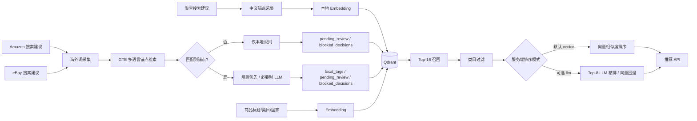

# JoyTag MRD、PRD、BRD（代码对齐修订版）

> 文档版本：2026-08-24
>
> 实现基线：当前 JoyTag 仓库 `main` 分支代码
>
> 本文是原《JoyTag MRD、PRD、BRD》的代码对齐修订版。原文中的市场愿景、商业路径和财务模型仅在标注为“商业假设”时保留，不构成已经交付、已经验证或已经接入客户系统的陈述。

## 0. 状态口径与范围

本文使用以下状态标签：

- **[已实现]**：可在当前仓库找到对应源码、接口、数据结构或管理页面。
- **[待实现]**：产品路线图能力，当前代码没有完整实现，不应进入现行接口承诺。
- **[商业假设]**：市场、定价、融资、成本、转化和收入判断，需通过客户访谈、试点数据、法律或财务审查验证。

当前产品边界：

- **[已实现]** JoyTag 是本地化标签推荐后端 API、采集与审核流水线、合规治理能力和内嵌管理后台。
- **[待实现]** JoyTag 不是消费者搜索引擎，也尚未接入真实平台的搜索排序、商品上架或商品—Tag 绑定链路。
- **[待实现]** 当前没有多租户 SaaS、商家自助注册、订阅计费、店铺插件、A/B 实验平台或转化数据看板。
- **[商业假设]** “改善搜索命中、运营效率或转化率”是待试点验证的业务目标，不能表述为已取得的客户结果。

---

# 第一章 项目简介与市场需求（MRD）

## 1.1 问题定义

欧洲跨境电商的商品发现链路可能同时存在三类问题：

1. 中文商品描述与目标市场真实搜索表达存在语义差异。
2. 同一标签在不同国家可能具有不同文化、广告或消费者保护风险。
3. 仅依赖生成式模型会带来候选来源不明、输出不可控和难以审计的问题。

JoyTag 的产品思路是先形成带来源和审核状态的结构化标签库，再从已入库标签中检索和排序。标签可以作为未来商品运营或搜索系统的输入，但当前仓库只交付推荐 API 和管理后台。

## 1.2 当前解决方案

### 1.2.1 数据与审核流水线

**[已实现] 中文锚点：**

```text
淘宝搜索建议
  → 中文词去重与评分
  → 本地 Embedding
  → cn_anchors
```

中文采集的职责是建立中文锚点，不执行“中文词逐一进行六国语言合规评估”。

**[已实现] 海外标签：**

```text
中文锚点生成六国种子
  → Amazon 搜索建议（主源）+ eBay 搜索建议（辅助源）
  → 按国家配额合并与去重
  → GTE 多语言向量直接检索中文锚点
  → 无锚点：本地禁用/UCPD 规则拦截，否则进入人工审核
  → 有锚点：安全词/禁用词/UCPD 规则优先，必要时 LLM 合规评估
  → local_tags / pending_review / blocked_decisions
```

### 1.2.2 推荐链路

**[已实现]** 调用方提交商品标题、目标国家、可选类目和返回数量。系统执行：

```text
商品标题 + 类目
  → 本地向量化
  → 按国家和“可复用”状态召回 top-16
  → 可选类目过滤
  → 默认按向量相似度排序，不调用 LLM
  → 服务端可选：标题假名化后将最多 top-8 候选交给 LLM 精排
  → 默认最多返回 5 条；接口允许 1—10 条
```

默认 `RECOMMEND_RERANK_MODE=vector`，推荐请求产生 0 次 LLM 调用。服务端切换到 `llm` 时，模型返回的词仍必须来自候选集；非法词、重复词或格式错误会被过滤，缺口按向量相似度补齐，LLM 不可用时回退为向量排序。客户端请求体不能自行启用 LLM。

## 1.3 用户与使用场景

| 用户/系统 | 当前状态 | 当前或未来价值 |
| --- | --- | --- |
| 管理员 `admin` | [已实现] | 管理规则、标签、锚点、拦截记录、审计、DSAR 与留存策略 |
| 审核员 `reviewer` | [已实现] | 审核存疑词，记录通过或拒绝理由 |
| 采集运营 `operator` | [已实现] | 触发采集、维护定时任务、查看运行统计 |
| 服务调用方 | [已实现] | 通过 Bearer token 和 `joytag:recommend` scope 调用推荐 API |
| 商品运营工作台 | [待实现] | 在商品上架流程中展示、采纳或拒绝 Tag |
| 消费者搜索系统 | [待实现] | 消费商品关联 Tag 并参与召回或排序 |
| 独立站商家 | [待实现] | 通过未来 SaaS 或插件自助接入 |

## 1.4 价值目标与验证指标

以下指标均为待验证目标，不是当前结果：

| 目标 | 建议验证指标 | 状态 |
| --- | --- | --- |
| 提升运营效率 | 单 SKU 标签处理时间、人工审核量、Tag 采纳率 | [商业假设] |
| 改善搜索覆盖 | 搜索无结果率、长尾查询覆盖率、召回增量 | [商业假设] |
| 控制内容风险 | 规则命中率、人工推翻率、漏拦截率、误拦截率 | [商业假设] |
| 改善业务效果 | 点击率、加购率、搜索转化率、退货率 | [商业假设] |

任何转化收益都需要在真实客户数据、对照组、统计口径和观察周期明确后，通过 A/B 或准实验验证。

---

# 第二章 市场、数据与合规边界（MRD）

## 2.1 市场判断

- **[商业假设]** 欧洲多语言、多文化环境会增加商品标签本地化和规则运营成本。
- **[商业假设]** 结构化标签可能比持续扩写前台商品标题更适合兼顾简洁展示和后台召回。
- **[商业假设]** 平台和跨境商家愿意为可解释、可审核、可追溯的本地化能力付费。
- **[待验证]** 目标客户、采购主体、预算、销售周期和接入成本尚需客户访谈和真实试点确认。

## 2.2 当前数据来源

| 数据 | 来源 | 用途 | 状态 |
| --- | --- | --- | --- |
| 中文搜索建议 | 淘宝搜索建议接口 | 构建 `cn_anchors` | [已实现] |
| 海外搜索建议 | Amazon completion | 六国海外趋势主源 | [已实现] |
| 海外搜索建议 | eBay autosuggest | 六国海外趋势辅助源 | [已实现] |
| 商品标题与类目 | 推荐 API 调用方 | 标签召回与排序 | [已实现] |
| 商品、订单、点击、转化数据 | 客户业务系统 | 绑定、实验与效果分析 | [待实现] |

当前实现不以社交媒体趋势采集作为现行数据源。新增任何外部来源前，需要分别完成接口稳定性、许可条款、数据库权利、隐私、留存和成本评估。

## 2.3 AI 能力边界

**[已实现]** LLM 参与：

- 中文锚点向六国种子的批量翻译；
- 已匹配中文锚点、且本地规则未覆盖的海外词合规评估；
- 服务端显式启用时，对推荐候选进行排序与内部理由生成。

多语言锚点匹配由本地 GTE Embedding 完成。无中文锚点的海外词不会调用合规 LLM；默认推荐排序也不会调用 LLM。

**[已实现]** 最终标签来自已入库的结构化候选词条，LLM 不能在推荐接口中新增未入库标签。

因此，系统不能笼统描述为“完全非生成式”：动态种子翻译、必要的合规评估以及可选精排仍可能包含生成式 AI 参与；准确表述应是“默认推荐为本地向量排序，核心标签受候选集约束，生成式模型不直接创造最终标签”。

## 2.4 合规工程控制

**[已实现]** 当前代码包含：

- Keycloak OIDC 授权码 + PKCE、RBAC、服务 scope 与 TOTP 配置；
- 管理写操作的 CSRF 双提交保护；
- Postgres hash-chain 管理审计与全链验证；
- LLM provider 适配、PII 假名化、prompt 哈希和 `llm_trace`；
- 采集 run 和词级输出的 lineage；
- `blocked_decisions` 拦截决策持久化；
- DSAR 工单、跨库检索、擦除和 ERASE 证据；
- 默认留存策略、定时清理和透明度披露接口/页面；
- UCPD Annex I 相关环保声明规则种子。

**[待实现/外部落实]**：

- 生产域名、TLS 反向代理与 Secure Cookie 配置；
- 数据卷自动备份和恢复演练；
- 客户侧数据处理协议、供应商评估和处理活动记录；
- 各目标国家规则、数据来源许可和披露文本的独立法律审查；
- 生产监控、告警、密钥托管和渗透测试。

上述控制是工程能力，不构成法律意见，也不能自动保证 GDPR、DSA、UCPD 或 AI Act 合规。

---

# 第三章 产品与技术需求（PRD）

## 3.1 产品定位

**[已实现]** JoyTag 当前定位为“欧洲多站点本地化标签推荐与合规治理后端”。交付物包括：

1. 推荐 API；
2. 淘宝/Amazon/eBay 采集与对齐流水线；
3. 标签、锚点、审核和拦截数据存储；
4. 管理审核、规则、调度、审计与 DSAR 单页后台；
5. 公开参数与透明度披露。

## 3.2 当前功能需求

### F1 中文锚点采集

- 从淘宝搜索建议采集中文词；
- 按位置评分、去重和进度文件跳过已处理词；
- 使用本地 Embedding 写入 `cn_anchors`；
- 保存来源、采集批次与时间。

### F2 海外标签采集

- 从最新中文锚点动态生成六国种子，失败时使用固定种子回退；
- Amazon 与 eBay 并行抓取，按国家和来源配额去重；
- 先按类目过滤，再使用 GTE 多语言向量直接检索相近中文锚点（默认阈值 0.60，无类目时 0.75）；
- 无锚点词只执行本地规则：禁用/UCPD 命中时硬拦截，其余进入人工审核，不调用 LLM；
- 有锚点词按安全规则、禁用/UCPD 规则、必要的 LLM 评估依次分流；
- 分别写入 `local_tags`、`pending_review` 或 `blocked_decisions`。

### F3 人工审核与规则沉淀

- 审核员查看待审核词；
- 通过后写入标签库和安全规则；
- 拒绝时理由必填，并写入拦截规则；
- 管理变更保留操作者与 hash-chain 审计记录。

### F4 标签推荐

- 请求字段：`title`、`target_country`、可选 `category`、`top_k`；
- 国家限定为 `DE/FR/NL/UK/IT/ES`；
- `top_k` 范围为 1—10，默认 5；
- 只召回目标国家且 `compliance_status=可复用` 的词；
- 默认对类目过滤后的全部候选按向量相似度排序，不查询趋势热词，也不调用 LLM；
- 服务端可配置 LLM 精排，LLM 只能选择最多 top-8 个候选词，失败时按向量相似度回退；
- 响应保留来源、合规理由、中文锚点、趋势分、相似度和 AI 参与状态；
- 正常、空结果和回退结果均返回版本与披露地址。

### F5 管理与透明度

- 管理后台提供概览、待审核、标签库、采集、规则、锚点库、拦截记录、审计和 DSAR 九个页签；
- 管理 API 统一使用 `/admin/api/...`；
- 公开 `/v1/disclosure/parameters`、`/v1/transparency`、`/transparency` 和 `/v1/dsar/request`。

## 3.3 技术架构

JoyTag 当前采用“采集与对齐—合规决策—向量存储—推荐输出”的分层架构。MVP 重点是用较少的基础设施验证词库建设、规则沉淀和推荐 API 闭环；Ops 上架组件、消费者搜索接入和 SaaS 化能力仍属于后续产品化范围。

### 3.3.1 总体架构



### 3.3.2 技术组件选型

| 层 | 当前选型 | 当前实现说明 |
| --- | --- | --- |
| Backend | Python 3.11 + FastAPI + Uvicorn | 异步 API、采集触发、管理路由和生命周期管理 |
| 管理 UI | 静态 HTML + 原生 JavaScript | 内嵌单页，无 React、无前端构建链、无独立前端服务 |
| 中文数据源 | 淘宝搜索建议 | 用于中文锚点采集；当前不描述为六国语言合规评估流程 |
| 海外数据源 | Amazon completion + eBay autosuggest | Amazon 为主源，eBay 为辅助源 |
| Embedding | 本地 `Alibaba-NLP/gte-multilingual-base` | 768 维；优先从 `backend/models/gte-multilingual-base/` 加载，模型权重不进入 Git |
| LLM | provider 适配层 | 默认 DeepSeek 的 OpenAI-compatible 接口，可配置 Azure 和 Bedrock |
| 向量库 | Qdrant 1.9.0 | 四个集合、余弦距离、确定性 ID、payload 保存 provenance |
| 合规数据库 | PostgreSQL 16 | audit、llm_trace、lineage、DSAR 和 retention 数据 |
| 身份与权限 | Keycloak 24.0.5 | OIDC、RBAC、TOTP、服务间 scope 和会话 CSRF |
| 调度 | APScheduler 3.x | 采集任务、手动运行和每日留存清理 |

### 3.3.3 数据采集与语义处理流程

**中文锚点流程**：淘宝搜索建议采集中文长尾词，按位置评分、去重并结合进度文件跳过已处理词，随后用本地 Embedding 写入 `cn_anchors`。中文锚点主要承担跨语言对齐的底座作用，不在当前流程中虚构六国语言逐词合规评估结果。

**海外标签流程**：

```text
最新中文锚点生成六国种子
    -> Amazon completion 与 eBay autosuggest 按国家采集
    -> 跨源去重、国家配额合并和来源透传
    -> GTE 多语言向量直接检索中文锚点
    -> 无锚点：仅本地规则，禁用则拦截，否则人工审核
    -> 有锚点：规则优先，规则未覆盖时 LLM 合规评估
    -> local_tags / pending_review / blocked_decisions
```

该流程中的每条词都保留 `source_type`、`collection_run_id`、`collected_at` 等来源信息。LLM 参与动态种子翻译、有锚点且规则未覆盖词的合规评估，以及可选推荐精排；最终写入推荐池的标签必须来自已入库的结构化词条，不允许由 LLM 直接生成未入库词。

**合规漏斗**：

1. 先用本地 GTE 向量尝试匹配中文锚点；
2. 无锚点时只执行本地规则：国家禁用词或 UCPD Annex I 规则命中则写入 `blocked_decisions`，否则写入 `pending_review`；安全词命中也不自动入库；
3. 有锚点时安全词直接通过，国家禁用词和 UCPD 规则硬拦截，其余才进入 LLM 评估；
4. LLM 结果分为“可复用”“存疑”和“需拦截”；“存疑”词进入 `pending_review`，人工通过后写入安全规则和 `local_tags`，拒绝后沉淀为拦截规则。

**隐私边界**：当前 Embedding 在本地完成，不把商品标题发送给 Embedding 服务；默认推荐模式也不把商品标题发送给外部 LLM。仅服务端启用 LLM 精排时，标题才会先经 Presidio regex-only 假名化后发送；日志和 LLM trace 只保存哈希、token 类型映射及必要的审计信息。

### 3.3.4 推荐链路

1. 接收商品标题、目标国家、可选类目和 `top_k`；
2. 使用同一套本地 Embedding 模型生成查询向量；
3. 在 Qdrant 中按国家和 `compliance_status=可复用` 过滤，召回最多 16 个候选；
4. 应用层执行类目过滤；
5. 默认模式对过滤后的全部候选按相似度降序、去重并截取 `top_k`，不查询趋势热词、不做假名化、不调用 provider；
6. 服务端可配置 `RECOMMEND_RERANK_MODE=llm`，将最多 8 个候选交给 LLM 精排；
7. LLM 只能从候选集合中选择词条，非法词、重复词和格式错误结果会被丢弃；LLM 不可用或响应解析失败时回退向量顺序；
8. 默认返回最多 5 条，接口允许 `top_k=1—10`；响应中的 `ai_generated` 和 `ai_assisted` 反映本次请求是否实际使用 LLM。

### 3.3.5 运行、认证与合规控制

- 管理端 `/admin` 通过 Keycloak OIDC 登录，角色分为 `admin`、`reviewer` 和 `operator`；
- 推荐服务间调用使用 Bearer token 和 `joytag:recommend` scope；
- 管理写操作要求 CSRF 双提交校验，并通过 hash-chain 审计记录操作者、动作和资源；
- LLM 调用保存 prompt 哈希、PII token 映射和词条哈希，采集任务保存 lineage 事件；
- DSAR 支持跨 Qdrant、LLM trace、lineage 和 audit 数据检索及擦除；
- `transparency.py`、`/v1/disclosure/parameters` 和公开透明度页面共用版本化披露内容；
- 生产必须备份 Qdrant 词库卷和 PostgreSQL 审计证据，Embedding 模型缓存可以重建但不能替代业务数据备份。

## 3.4 Qdrant 数据模型

当前四个集合使用 768 维余弦向量。`pending_review` 和 `blocked_decisions` 不参与语义检索，但使用 768 维零向量作为 Qdrant 点位占位，以便统一保存和分页管理。

| 集合 | 向量 | 目的 | 主要 payload |
| --- | --- | --- | --- |
| `cn_anchors` | 768 维本地 Embedding | 中文锚点库，不直接作为对外标签输出 | `cn_word`、`category`、来源和采集批次 |
| `local_tags` | 768 维本地 Embedding | 推荐唯一标签来源 | `word`、`country`、合规状态、来源、趋势分、中文锚点 |
| `pending_review` | 768 维零向量 | 人工待审核队列 | 词条、国家、审核理由、规则和 provenance |
| `blocked_decisions` | 768 维零向量 | 被拦截词与决策证据 | 词条、国家、理由、rule_id、来源和 trace |

所有自然键使用确定性 UUID：中文锚点按 `cn_word` 生成，标签和审核记录按 `word + country` 生成。词条的向量、业务字段和合规字段分开保存，删除或 DSAR 擦除时可以按记录 ID 处理完整链路。

## 3.5 主要 API 契约

| 方法与路径 | 访问控制 | 用途 |
| --- | --- | --- |
| `POST /v1/tag/recommend` | Bearer + `joytag:recommend` | 标签推荐；限流 20/min |
| `GET /health` | 公开 | Qdrant、PostgreSQL 与 Embedding 健康检查；`deep=1` 只验证 LLM 配置，`llm_probe=1` 需共享密钥并产生一次真实请求 |
| `GET /v1/disclosure/parameters` | 公开 | 推荐参数披露 |
| `GET /v1/transparency` | 公开 | 透明度 JSON |
| `POST /v1/dsar/request` | 公开、5/hour | DSAR 受理 |
| `POST /admin/api/collect/overseas` | operator | 海外采集 |
| `POST /admin/api/collect/cn` | operator | 中文锚点采集 |
| `/admin/api/schedules/*` | operator | 调度管理 |
| `/admin/api/pending/*` | reviewer | 待审核处理 |
| `/admin/api/tags/*` | 会话；删除 admin | 标签管理 |
| `/admin/api/anchors/*` | 会话；删除 admin | 锚点管理 |
| `/admin/api/rules/{country}/*` | 读取会话；写入 admin | 规则管理 |
| `/admin/api/blocked` | 读取会话；删除 admin | 拦截决策 |
| `/admin/api/audit*` | admin | 审计查看与校验 |
| `/admin/api/dsar/*` | admin | DSAR 检索与擦除 |
| `/admin/api/retention/*` | admin | 留存配置与清理 |

OpenAPI `/docs` 和受版本控制的 `backend/models/schemas.py` 是请求和响应字段的权威来源。

## 3.6 推荐响应示意

示例只说明当前响应字段，不保证固定标签、固定词条数量、固定相似度或固定时延：

```json
{
  "recommendations": [
    {
      "word": "已入库候选标签",
      "reason": "基于多语言向量相似度排序推荐",
      "similarity": 0.86,
      "source": "amazon_suggest",
      "compliance_reason": "通过规则与评估",
      "anchor_cn_word": "已入库中文锚点",
      "trend_score": 0.74,
      "ai_generated": false
    }
  ],
  "total_candidates": 16,
  "filtered_candidates": 8,
  "ai_assisted": false,
  "parameters_version": "2026-08-24",
  "disclosure_url": "/v1/disclosure/parameters"
}
```

`word` 必须来自已召回的候选集合。默认向量模式返回 `ai_generated=false`、`ai_assisted=false`；仅当当前请求实际完成 LLM 精排时才返回 AI 参与标记。该标记不表示生成了新的词条。空结果仍返回 `recommendations=[]`、真实候选计数、`ai_assisted=false`、参数版本号和披露地址。

## 3.7 MVP 演示与验收

演示基于当前 FastAPI、Qdrant、PostgreSQL、Keycloak 和 LLM provider 配置。采集结果会受到外部搜索建议接口、LLM、Embedding 模型、已有词库、网络和人工审核状态影响；默认推荐不依赖 LLM 上游可用性。系统不承诺固定词条数量、固定示例词或预设时延。

建议演示顺序：

1. 启动 Qdrant、PostgreSQL、Keycloak 和 Backend，访问 `/health` 与 `/health?deep=1`，确认均不产生模型请求；受控运维可用共享密钥执行一次 `llm_probe=1`；
2. 登录 `/admin`，确认角色权限和九个管理页签；
3. 调用 `POST /admin/api/collect/cn`，观察淘宝建议词写入 `cn_anchors` 及 lineage；
4. 调用 `POST /admin/api/collect/overseas`，观察 Amazon/eBay 来源、翻译、规则分流以及 `local_tags`、`pending_review`、`blocked_decisions` 的变化；
5. 在待审核页通过或拒绝一条词，验证规则库、Qdrant 记录和审计链同步更新；
6. 在默认向量模式调用 `POST /v1/tag/recommend`，核对候选集约束、provenance、相似度、固定理由以及 `ai_assisted=false`；
7. 模拟 LLM 不可用，验证默认推荐仍正常返回；再临时启用可选 LLM 模式，验证失败时回退向量排序且 `ai_assisted=false`；
8. 访问参数披露、透明度页面和 DSAR 受理接口。

当前技术演示使用本地 `Alibaba-NLP/gte-multilingual-base` 进行多语言向量化。LLM provider 用于动态种子翻译、有锚点且规则未覆盖词的合规判断，以及服务端可选精排；海外词锚点匹配、无锚点分流和默认推荐均不调用 LLM。演示数据以运行时实际采集、已有词库和审核结果为准。

## 3.8 非功能要求

- **可用性**：默认推荐不依赖 LLM；可选 LLM 精排失败时返回向量排序结果；海外采集按国家处理异常并使用既有种子回退；
- **一致性**：中文锚点、标签和查询必须使用同一 768 维 GTE Embedding 空间，不能混用不同模型产生的向量；
- **安全性**：生产必须启用认证、强密钥、TLS 和网络边界；管理写操作必须带 CSRF 与角色检查；
- **合规性**：词条来源、规则命中、LLM 评估、人工操作和拦截决策均需保留可关联证据；
- **可追溯性**：数据源、采集批次、模型调用、规则与人工操作可以通过 provenance、trace、lineage 和审计链关联查询；
- **可维护性**：API 契约集中在受版本控制的 `backend/models/schemas.py`；CI 执行 `import app` 和契约测试；
- **成本边界**：业务 LLM 请求仅对超时、连接错误、HTTP 408/429/5xx 重试一次，三类调用均设置输出 token 上限；普通与 deep 健康检查不请求外部模型；
- **规则一致性**：安全词和禁用词比较统一使用 NFKC、空白归一化与 casefold，同时保留标点、连字符和重音，原始词不被改写；
- **性能边界**：推荐链路采用 top-16 向量召回和类目过滤；默认直接对全部过滤候选按向量排序，可选模式才对最多 top-8 做 LLM 精排，最终默认返回最多 5 个结果；
- **数据恢复**：生产必须备份 Qdrant 与 Postgres；模型缓存可重建，业务词库、规则文件和审计证据不可仅靠源码恢复。

## 3.9 当前不在范围内

以下能力全部为 **[待实现]**：

- 商品运营上架组件和 Tag 采纳交互；
- 商品 ID 与标签绑定、批量商品导入和 ERP/PIM 同步；
- 消费者查询接入、搜索召回和最终排序；
- 多租户、组织/店铺隔离、商家注册和租户级 RBAC；
- 订阅计费、配额、账单、支付和用量结算；
- Shopify、WooCommerce 或其他应用市场插件；
- A/B 测试、点击/加购/转化埋点和效果看板；
- 面向客户的 SLA、客服、工单和商业运营系统。

---

# 第四章 竞争与差异化假设（MRD/BRD）

## 4.1 候选差异化

- **[已实现]** 标签候选受结构化词库约束，不允许 LLM 在推荐接口中直接创造最终标签。
- **[已实现]** 数据源、锚点、相似度、合规理由、规则和 AI 参与状态可解释。
- **[已实现]** 锚点门控、本地规则、必要的 LLM 与人工审核组成分层治理，并保存拦截证据。
- **[商业假设]** 这些能力相对于通用翻译、通用 LLM 或单一关键词工具能形成采购价值。
- **[待验证]** 推荐质量、规则覆盖、外部数据稳定性和客户系统集成成本是否构成长期优势。

## 4.2 主要风险

| 风险 | 当前控制 | 待验证/待落实 |
| --- | --- | --- |
| 外部接口变更或限流 | 双源、缓存、固定种子回退 | 来源授权、长期 SLA 和替代源 |
| LLM 幻觉或不可用 | 默认推荐零 LLM、候选集校验、可选精排向量回退 | 离线评测集与质量阈值 |
| 规则误判/漏判 | 规则 ID、人工审核、审计 | 法律专家复核与持续更新 |
| 词库冷启动或数据丢失 | 自动采集、进度去重 | 备份恢复、导入工具或快照机制 |
| 客户集成复杂 | 标准 REST API | 商品/搜索系统适配器与实施方法论 |
| 商业效果不明确 | 可解释字段 | 真实试点、埋点和实验设计 |

---

# 第五章 项目实施规划

## 5.1 已完成：代码 MVP

**[已实现]**：

- 淘宝中文锚点、Amazon/eBay 海外建议采集；
- 本地 768 维 GTE Embedding 和四个 Qdrant 集合；
- 动态种子翻译、多语言锚点检索、锚点门控、规则、必要的 LLM 与人工审核流水线；
- 默认纯向量推荐、可选 LLM 精排、候选集约束、回退和 provenance；
- 管理单页、Keycloak/RBAC/CSRF；
- 审计、trace、lineage、DSAR、留存与透明度；
- Docker Compose 四服务部署定义。

“代码 MVP 完成”不等于“真实客户验证完成”或“生产上线完成”。

## 5.2 下一阶段：工程上线准备

**[待实现/待执行]**：

1. 建立生产域名、TLS、密钥托管、监控与告警。
2. 设计 Qdrant/Postgres 自动备份，执行恢复演练并记录 RPO/RTO。
3. 建立离线推荐与合规评测集，定义准确率、人工推翻率和回退率。
4. 完成数据源条款、隐私、DPIA、供应商和国家规则的法律审查。
5. 完成容量、并发、故障注入和安全测试。

## 5.3 客户试点阶段

**[待实现]**：

1. 选择一个明确品类和一个目标客户，避免同时扩张多个业务面。
2. 对接商品目录与运营流程，但先由人工确认 Tag，不直接影响消费者排序。
3. 建立 Tag 采纳率、误判率、处理时长和搜索覆盖基线。
4. 在数据量和风险允许时接入搜索沙箱，设计对照组和回滚方案。
5. 仅在获得真实数据后形成客户案例或效果承诺。

## 5.4 产品化阶段

**[待实现]** 多租户、配额、计费、客户数据隔离、插件、SDK、自助接入和效果分析。是否进入该阶段应由客户试点、获客成本、集成成本和付费意愿共同触发，而不是按固定月份自动推进。

---

# 第六章 商业模式（BRD）

## 6.1 目标客户

- **[商业假设]** 平台型跨境电商：需要内部 API、规则治理和审计能力。
- **[商业假设]** ERP/PIM/搜索服务商：可能以 API 或私有部署方式集成。
- **[商业假设]** 中小独立站：只有在自助接入和插件完成后才具备规模化服务条件。

## 6.2 收费路径

以下均未在代码中实现：

| 模式 | 前置条件 | 状态 |
| --- | --- | --- |
| 定制试点/实施费 | 明确范围、验收指标和客户数据授权 | [商业假设] |
| API 用量计费 | 租户、配额、计量、账单、SLA | [待实现/商业假设] |
| SaaS 订阅 | 多租户、自助注册、支付、客服与运营 | [待实现/商业假设] |
| 私有化部署 | 自动化安装、升级、监控、支持和合同体系 | [待实现/商业假设] |
| 数据或规则增值服务 | 来源权利、质量与许可边界清晰 | [商业假设] |

## 6.3 商业验证门槛

进入规模化开发前，建议至少验证：

1. 目标客户是否把问题列为优先事项，采购方和预算归属是否明确；
2. 客户愿意提供哪些数据，安全和合规评审周期多长；
3. 单次集成工时、持续规则运营成本和 LLM/基础设施单位成本；
4. Tag 采纳、搜索覆盖或业务指标是否出现可重复改善；
5. 试点客户是否愿意转付费以及可接受的价格区间。

---

# 第七章 融资计划（商业假设）

本章全部为 **[商业假设]**，不表示融资已完成、投资人已确认或客户里程碑已达成。

## 7.1 融资口径

- 阶段：Pre-seed 假设；
- 金额：80—120 万元人民币的讨论区间；
- 预算示例：如需单一口径，以 100 万元中位数测算；
- 用途：客户验证、工程上线、合规审查、产品化准备和必要的运行资金；
- 跑道、估值和融资工具需由创始团队、投资人及专业顾问确认。

融资金额统一使用上述区间口径；早期收入情景不得与融资额混用。

## 7.2 建议的里程碑拨付逻辑

| 里程碑 | 可验证证据 |
| --- | --- |
| 生产准备 | TLS、监控、备份恢复、安全与法律审查清单 |
| 首个试点 | 双方确认的数据范围、验收指标和回滚方案 |
| 产品价值 | Tag 采纳、误判、处理时长和搜索覆盖的基线对比 |
| 付费验证 | 至少一个真实付费意向、合同或已收款项目 |
| 产品化决策 | 可重复交付、毛利空间和获客成本证据 |

---

# 第八章 财务分析（商业假设）

## 8.1 建模原则

财务模型必须区分：

- 一次性研发和集成成本；
- 每客户实施、支持与法律审查成本；
- LLM、云服务、监控、备份和外部数据的可变成本；
- 创始团队与正式员工的人力机会成本；
- 免费试点、合同收入、已收款和经常性收入。

## 8.2 当前不能作为事实使用的数字

在取得证据前，不应把以下内容写成确定结论：

- 固定 API 单次成本或外部数据“厘级”成本；
- 固定客户数、固定订阅价格或固定 API 调用量；
- 第一年、第二年、第三年的确定营收；
- “2—3 家客户即可盈亏平衡”；
- 固定转化率、无结果率下降或 Tag 采纳率目标必然达成。

## 8.3 建议财务情景

采用保守、基准、乐观三种情景，并为每个输入记录证据来源：

| 输入 | 保守 | 基准 | 乐观 | 验证来源 |
| --- | --- | --- | --- | --- |
| 有效商机数 | 待填 | 待填 | 待填 | 客户访谈/销售漏斗 |
| 试点转付费率 | 待填 | 待填 | 待填 | 已完成试点 |
| 客单价 | 待填 | 待填 | 待填 | 报价反馈/合同 |
| 单客户实施工时 | 待填 | 待填 | 待填 | 项目工时记录 |
| 月均模型与云成本 | 待填 | 待填 | 待填 | 实际账单 |
| 毛利率 | 待填 | 待填 | 待填 | 收入减直接成本 |

只有在真实账单、合同和工时记录形成后，才能更新现金流、盈亏平衡和下一轮融资需求。

---

# 附录 A：实现事实核对表

| 文档声明 | 代码证据 |
| --- | --- |
| API/Pydantic 契约与国家范围 | `backend/models/schemas.py` |
| 推荐路由与管理 API | `backend/app.py` |
| top-16 / 默认向量排序 / 可选 top-8 LLM / 默认 top-5 | `backend/services/recommend.py` |
| 四个 Qdrant 集合与 768 维向量 | `backend/services/qdrant_store.py` |
| 淘宝中文采集 | `backend/services/collectors/cn_ecommerce.py`、`cn_longtail.py` |
| Amazon/eBay 海外采集 | `amazon_suggest.py`、`ebay_suggest.py`、`overseas_trends.py` |
| Embedding 模型 | `backend/services/embedding.py` |
| LLM provider 与假名化 | `backend/services/llm_provider.py`、`pii_guard.py` |
| Keycloak/RBAC/CSRF | `backend/services/auth.py`、`keycloak/realm-export.json` |
| 审计/trace/lineage/DSAR/留存 | `audit.py`、`llm_trace.py`、`lineage.py`、`dsar.py`、`retention.py` |
| 管理单页 | `backend/static/admin.html`、`backend/static/js/admin.js` |

# 附录 B：变更管理规则

1. 代码是“已实现”事实的唯一来源；文档不得以路线图反推代码能力。
2. 修改推荐参数、DSAR 字段、留存天数或公开披露时，必须同步更新契约常量和透明度文案并递增版本。
3. 新增国家时必须同步后端国家权威源、Pydantic 契约、规则文件和管理前端。
4. 新增数据源或 LLM 供应商前，必须补充来源、许可、PII、trace、lineage、失败回退和成本说明。
5. 商业数据只有在注明样本、日期、口径和证据来源时，才能从“商业假设”改为“已验证”。
